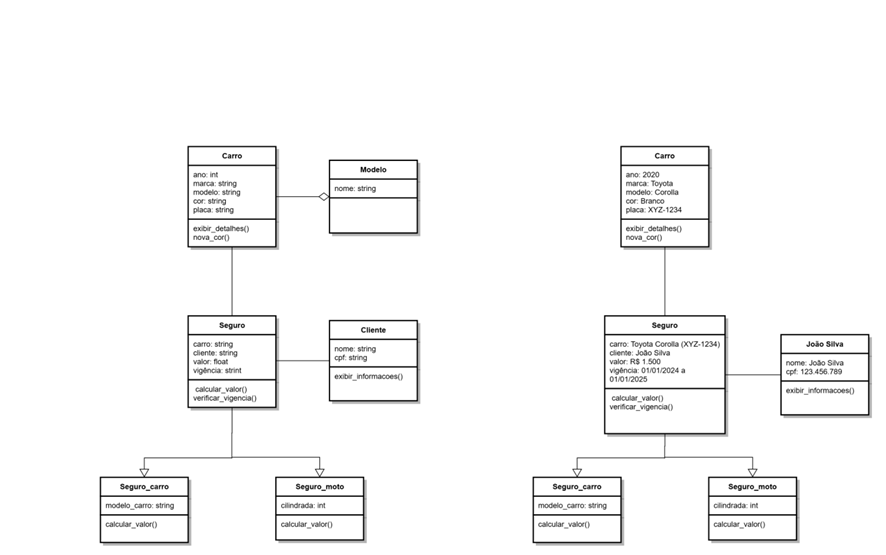

Exercício 3: Modelagem de Relacionamentos e Associações

b) Justifique o tipo de relacionamento (agregação ou composição) entre Seguro e Carro.
-> A relação entre Seguro e Carro é de agregação.
Em agregação o Seguro pode cobrir vários Carros, mas os Carros podem existir independentemente dos Seguros. Um Carro não depende de um Seguro para existir, Um carro pode ter múltiplos seguros ao longo do tempo. Além disso, um carro pode ser associado a vários Seguros ao longo de sua vida útil, o que reforça o conceito de agregação.

c) Escreva uma breve explicação sobre como você representaria um cliente com múltiplos seguros em seu modelo.
-> Um Cliente pode ter múltiplos Seguros. Isso é representado pela relação 1:N entre Cliente e Seguro. Para cada Cliente, temos uma lista da classe Seguro, cada um cobrindo um ou mais carros.

Exercício 4: Modelagem de Classes com Relações de Herança
b) Explique o benefício de usar herança para representar esses diferentes tipos de seguro.
-> A classe base Seguro_veiculo contém todos os atributos e métodos comuns a todos os tipos de seguro de veículos, como o valor e a vigência. As classes derivadas Seguro_carro e Seguro_moto herdam essas funcionalidades, evitando duplicação de código.

c) Dê um exemplo de como um método calcular_valor() poderia ser implementado na classe SeguroVeiculo e sobrescrito nas classes SeguroCarro e SeguroMoto para incluir cálculos específicos.
-> 

Exercício 5: Criação de Diagramas UML de Objetos
    Tarefas
c) Explique como este diagrama ajuda a visualizar a estrutura do sistema para um cliente específico.
-> O diagrama de objetos UML mostra como as instâncias específicas das classes se relacionam no contexto de um cliente específico, seu carro e o seguro correspondente.
Através deste diagrama, podemos ver como os objetos João Silva, Toyota Corolla e Seguro existem no sistema com valores reais atribuídos aos seus atributos.
A visualização dos dados reais como o nome do cliente, o modelo do carro, o valor do seguro facilita a compreensão de como o sistema funcionaria no mundo real.

Exercício 6: Exercício de Abstração e Encapsulamento
a) Em uma implementação fictícia das classes Cliente e Carro, faça uso de encapsulamento, ocultando atributos como cpf e placa e expondo apenas métodos públicos para acessá-los.
